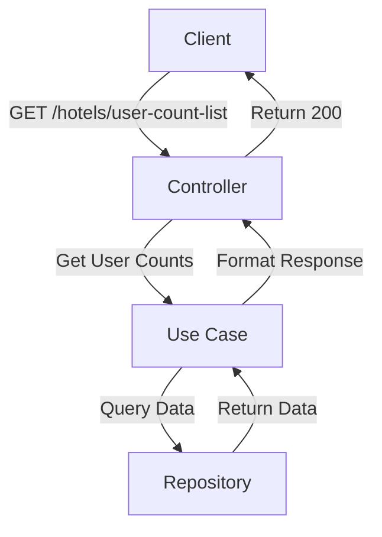
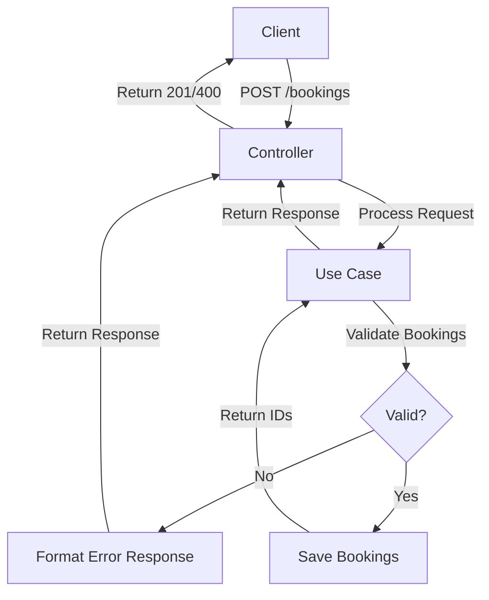

# THN Project

A Laravel-based hotel management system built with Domain-Driven Design (DDD) principles.

## 🚀 Features

- Hotel management with rooms and bookings
- Domain-Driven Design architecture
- Clean code principles
- Comprehensive test suite (Unit and Behat tests)
- RESTful API endpoints
- Value Objects for domain validation
- Repository pattern implementation

## 📋 Requirements

- PHP 8.4 or higher (^8.4)
- Laravel 12.0
- Composer
- SQLite

## 🛠️ Installation

1. Clone the repository:

```bash
git clone https://github.com/laurazapa/thn.git
cd thn
```

2. Install dependencies:

```bash
composer install
```

3. Set up environment:

```bash
cp .env.example .env
cp .env.behat.example .env.behat
php artisan key:generate
```

4. Set up databases:

```bash
# Main database
touch database/database.sqlite
php artisan migrate

# Test database
touch database/database_behat.sqlite
php artisan migrate --env=behat
```

5. Seed the database with example data:

```bash
php artisan db:seed
```

## 🔧 Development

Start the development server:

```bash
php artisan serve
```

The application will be available at `http://localhost:8000` (or the port you specify).

## 📡 API Endpoints

You can test the API endpoints using tools like Postman. Here are some example endpoints with real data from the seeder:

```bash
# Get hotel information (example)
GET http://localhost:8000/api/hotels/5a69179a-3b9d-4c0e-960d-91649eaab013

# Get user booking statistics per hotel
GET http://localhost:8000/api/hotels/user-count-list

# Create bookings
POST http://localhost:8000/api/hotels/bookings

# Example JSON body for POST /api/hotels/bookings
{
  "bookings": [
    {
      "userId": "9d491317-a39b-4ffd-91fe-9a91a5d21ece",
      "roomId": "4f89e181-935d-4f1b-b72a-dfc34c16fca2",
      "checkInDate": "2025-12-07",
      "checkOutDate": "2025-12-08"
    },
    {
      "userId": "9d491317-a39b-4ffd-91fe-9a91a5d21ece",
      "roomId": "7c9e6679-7425-40de-944b-e07fc1f90ae7",
      "checkInDate": "2026-04-04",
      "checkOutDate": "2026-04-05"
    }
  ]
}
```

## 📊 API Flow Diagrams

### GET /hotels/{uuid}
```mermaid
flowchart TD
    A[Client] -->|GET /hotels/{uuid}| B[Controller]
    B -->|Get Hotel Info| C[Use Case]
    C -->|Find Hotel| D[Repository]
    D -->|Return Hotel| C
    C -->|Format Response| B
    B -->|Return 200| A
```

### GET /hotels/user-count-list


### POST /bookings


## 🏗️ Architecture

The project follows a DDD structure with separation of concerns:

```
src/
├── Bookings/           # Booking bounded context
│   ├── Application/    # Use cases and DTOs
│   ├── Domain/         # Entities, Value Objects, and Domain Services
│   └── Infrastructure/ # Repository implementations
├── Hotels/             # Hotel bounded context
├── Users/              # Users bounded context
└── Shared/             # Shared domain code
```

## 🧪 Testing

The project includes a comprehensive test suite:

```bash
# Run all PHPUnit tests
./vendor/bin/phpunit
# Run specific PHPUnit test (same but with path from content root)
./vendor/bin/phpunit tests/Unit/Hotels/Hotels/Application/UseCase/GetHotelUseCaseTest.php

# Run all Behat tests
APP_ENV=behat ./vendor/bin/behat
#Run specific Behat test (same but with path from content root)
APP_ENV=behat ./vendor/bin/behat tests/Behat/Features/Hotels/get_hotel.feature
```

## 💡 Things to Improve

- Decouple domain entities from Laravel Eloquent (currently, domain models extend Eloquent's Model)
- Implement authentication and authorization
- Improve error handling and logging
